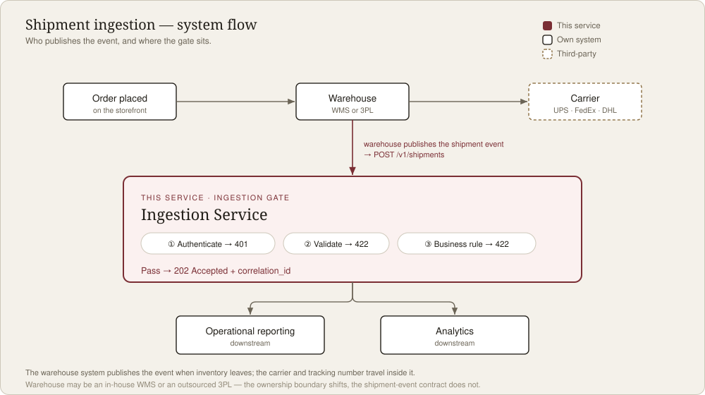

**English** · [繁體中文](README.zh-TW.md)

# Shipment Ingestion Service

A lightweight FastAPI service that ingests shipment events published by a
warehouse system — it authenticates the caller, validates the payload, enforces
a business rule, and forwards the clean event downstream for reporting and
analytics.

## 📖 Full walkthrough + live demo

### → https://srichsun.github.io/shipment-ingestion-service/

The problem, the request flow, the design decisions, the API reference, and an
interactive in-browser demo all live there. Everything below is just enough to
run it.



## Quick start

```bash
python -m venv .venv && source .venv/bin/activate
pip install -r requirements-dev.txt
export API_KEY=dev-local-key          # or put it in .env
uvicorn app.main:app --reload         # interactive docs at http://localhost:8000/docs
pytest                                # run the tests
```

## Tech

Python 3.11+ · FastAPI · Pydantic v2 · pytest · GitHub Actions CI

> Personal demo project exploring how to design a robust, evolvable integration
> service for e-commerce fulfillment.
